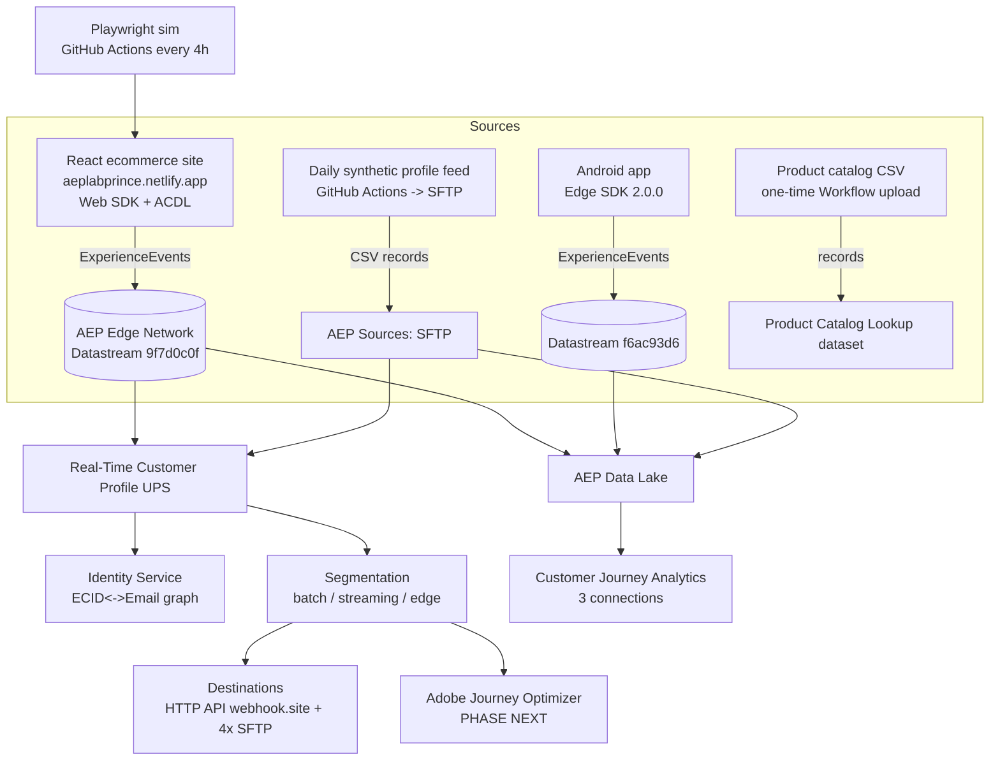
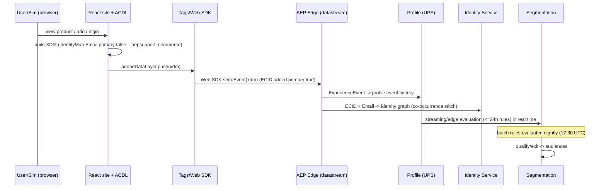
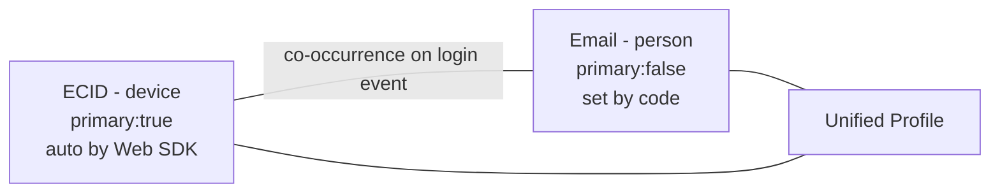

# Adobe Experience Platform (RTCDP) Learning Lab — Complete Handoff & Context Prompt - Creating it as Promt in case i need it in future : Prince :)

> **HOW TO USE THIS DOCUMENT (read me first):**
> You are picking up an in-progress, hands-on Adobe Experience Platform (AEP / Real-Time CDP) learning lab built around a live ecommerce demo site. The **coding is essentially complete**; the user's focus is now **practical AEP implementation and learning** — moving from **coding → AEP → Segmentation → AJO → CJA → troubleshooting**. Do **not** re-derive or re-explain things marked ✅ DONE. Guide the user step-by-step through the *next* learning stages (AJO first, then CJA analysis), verifying against Adobe docs and never inventing field names, IDs, or behavior. The user is an Adobe employee and values precision ("don't hallucinate; verify"), collaborative correction, and identity-graph safety above all. Prefer concise, actionable, numbered steps. When unsure of an exact UI label or API behavior, say so and verify. Respond in English unless asked for Hinglish.

---

## 1. PROJECT OBJECTIVE & OVERALL USE CASE

Build an **end-to-end RTCDP lab** that mirrors a real-world B2C ecommerce customer-data implementation, to *learn by doing* every major AEP capability:

- Collect **web behavioral events** (and later **mobile app** events) via Web SDK / Edge.
- Ingest **customer profile attributes** (batch, from files) and a **product catalog lookup**.
- Resolve **identity** (device ECID ↔ person Email) into unified profiles.
- Build **batch, streaming, and edge audiences** with real marketing use cases.
- **Activate** audiences to destinations (HTTP API streaming + SFTP).
- Analyze in **Customer Journey Analytics (CJA)** comparing stitching methods.
- Orchestrate with **Adobe Journey Optimizer (AJO)** (next phase).
- Keep the whole thing **fed automatically every day** (synthetic batch feed + simulated streaming journeys) so audiences continuously qualify.

**The demo brand:** "Prince AEP Lab" — a fake online store (products from `fakestoreapi.com`).

---

## 2. ARCHITECTURE & COMPONENTS

**Components in play:** Web SDK (alloy) + Tags/Launch + Adobe Client Data Layer (ACDL); AEP Edge Network + Datastreams; Schemas (XDM) & Datasets; Real-Time Customer Profile (UPS); Identity Service; Segmentation Service; Destinations; Query Service; Customer Journey Analytics; (next) Adobe Journey Optimizer; Android Edge Mobile SDK; GitHub Actions automation; SFTP (`ftp.omniture.com`).

---

## 3. ENVIRONMENT, IDS & CONFIGURATION (source of truth)

| Item | Value |
|---|---|
| Org | **AEP Support** — `B504732B5D3B2A790A495ECF@AdobeOrg` |
| Sandbox | **princeparvat-prod** — `0d58e018-0e2f-4b5d-98e0-180e2feb5d57` — region **VA7** |
| Tenant namespace | `_aepsupport` |
| Web datastream | `9f7d0c0f-e448-439e-af0b-5a4d47f6e456` |
| Mobile datastream | `f6ac93d6-438f-4116-98da-1c91fcb7597f` |
| Site (prod) | https://aeplabprince.netlify.app (Netlify) |
| AEP API auth | UI bearer token + `x-api-key: acp_ui_platform` |
| CJA API auth | bearer (from cja.adobe.io session) + `x-api-key: exc_app` + `x-gw-ims-org-id: B504732B5D3B2A790A495ECF@AdobeOrg` + `x-gw-region: va7`, host `https://cja.adobe.io/data/connections` |
| Merge policy (default, active-on-edge) | `fd629cfe-f3fb-4271-b394-16868c3ed3da` (Default Timebased) |

**Datasets / schemas:**

| Purpose | Schema | Dataset (table) | Dataset ID | Class |
|---|---|---|---|---|
| Web events | `prince_aep_lab_events` | `prince_aep_lab_events - prod` (`prince_aep_lab_events_prod`) | `6a393048319b011e37f75ad0` | ExperienceEvent |
| Customer profile | (Profile schema, Email primary identity, custom `_aepsupport` FG + Demographic Details) | `Prince AEP Lab - Customer Profile DS` | `6a7b54b827dc12eceb2298eb` | Individual Profile |
| Product catalog lookup | `Prince Product Catalog Lookup` (custom class **Product Catalog Class**, Record) | `prince_product_catalog_lookup` | `6a8e5ec9035656b04029907e` | Record (lookup) |
| Mobile events | `prince_aeplab_mobile_events` | `prince_aep_mobile_events` | `6a7e4d627ad17dcb9184ec5c` | ExperienceEvent |

**Identity namespaces:** `ECID` (device, cookie), `Email` (person). **Namespace CODE for API/Glass lookups is `Email` (capitalized), not `email`** — this tripped us up once.

---

## 4. REPOSITORIES & CODE DEVELOPED

### Repo A — `ecommerce-site-websdk_cja` (the React site)
- Deployed to Netlify `aeplabprince.netlify.app`. Light "device-first" ecommerce theme. Star ratings rendered via a `StarRating` JSX component using HTML entities (fixed a unicode garbling issue).
- **`src/tracking/initDataLayer.js`** — the heart of tracking (ACDL push pattern):
  - `buildIdentityMap(email, authenticatedState)` → `{ Email: [{ id, authenticatedState, primary: false }] }`. **ECID is intentionally NOT set here** — the Web SDK adds ECID automatically as `primary: true` (device-first).
  - `getCurrentIdentityMap()` / `getAuthState()` — read stored auth (localStorage `ECOM_AUTH_USER`).
  - Event pushes (each builds XDM + pushes to `window.adobeDataLayer`): `pushPageView` (via PageTracker on route change), `pushViewItemEvent` (fires on ProductDetail load → `commerce.productViews`), `pushAddToCartEvent` (`commerce.productListAdds`), remove/viewCart, `pushBeginCheckout`/checkoutClick (`commerce.checkouts`), `pushPurchaseEvent` (`commerce.purchases`, sends `commerce.order.purchaseID` + `priceTotal`), `pushLoginEvent` (identityMap.Email authenticated — the stitch push), `pushLogoutEvent` (empty identityMap), `pushFeedbackSubmittedEvent`, exit intent.
  - Custom fields all under tenant `_aepsupport`: `page {pageType,pageCategory,previousPage,viewport}`, `session`, `user {authId=email, loginMethod, ...}`, `ecid` (plain-string ECID field), `feedback`.
  - `productListItems[]` carry `SKU` (= product id), `name`, `priceTotal`, `quantity`, `currencyCode`, and `_aepsupport {unitPrice, category, rating}`.
  - Documented device-first vs person-first strategy; an inert **commented-out** person-first toggle exists (uncomment + datastream change to activate). No live commented code beyond documentation.
- **`src/pages/Login.js`** — email-only login (no password); calls `login(email)` then `pushLoginEvent(email)` then navigates. This is what stitches Email↔ECID.
- **`src/pages/ProductDetail.js`** — `productId = slug.split("-")[0]`; fetches `fakestoreapi.com/products/{id}`; on success calls `pushViewItemEvent` (this is why direct URL `/product/<id>-x` fires a product view).
- **`src/pages/Product.js`** — products listing; each card has `+ Cart` button and a `<Link>Details</Link>` → `/product/{slug}`.

### Repo B — `aep-profile-feed` (PRIVATE automation) — GitHub `princeparvat80/AEP--Bot_Profile_Update`
> PRIVATE because it contains real colleague names. SFTP password lives ONLY in GitHub Secrets (never in code/chat).
- **`scripts/daily_profile_feed.js`** — generates a daily delta (**5 updated + 5–10 new + 2–3 churned/exited**), writes a plain CSV → SFTP `/aep_profile_feed_ingest` (AEP incremental dataflow picks it up) and a **color-coded XLSX** (green=new, yellow=updated w/ bold changed cells, red=churned) → `/aep_profile_feed_review`. Uploads via `ssh2-sftp-client`. Commits roster state back. **Only the bot writes `data/daily/_roster.json`** — never run the feed locally & commit (causes merge conflicts). Runs cron `0 15 * * *` (15:00 UTC).
- **`stream-sim/simulate_journeys.js`** — Playwright + **Microsoft Edge** (`channel:'msedge'`), **one isolated browser context per profile** (guarantees **1 ECID per email** = identity-graph-safe by construction). Reads emails from roster (or seed CSV). Per profile: home → login (verifies `authState=authenticated`, aborts if not) → **views 1–3 products by navigating DIRECTLY to `/product/<id>-x`** → 70% add to cart → 30% of adders remove → 50% of adders checkout → 20% of checkouts purchase. Human think-times 2–8s; 30–90s between profiles. Verifies ECIDs are unique within a run (aborts on duplicate). Logs `viewed product N · rendered=true`. **`SIM_EMAILS="a@x,b@x"` env override** targets specific profiles for testing.
- **`data/customer_profiles_500.csv`** — 500 seed profiles (61 real teammate names + synthetic fill), emails `@aep.com`, loyaltyTier distribution: **Bronze 217 / Silver 144 / Gold 102 / Platinum 37**, plus loyaltyPoints, lifetimeValue, totalOrders, AOV, dates, favoriteCategory, preferredChannel, consent flags.
- **`data/product_catalog_lookup.csv`** — 20 products: `productSKU, productName, brand, category, gender, listPrice, cost, inStock, imageUrl`.
- **`.github/workflows/daily-profile-feed.yml`** — cron 15:00 UTC; commits roster back (`contents: write`).
- **`.github/workflows/streaming-sim.yml`** — cron `23 1,5,9,13,17,21 * * *` (every 4h); kill-switch `if: vars.SIM_ENABLED != 'false'`; `concurrency` group prevents overlap; installs Playwright + msedge.

---

## 5. LAUNCH / TAGS IMPLEMENTATION

**Web property (Tags/Launch):**
- Extensions: **Adobe Experience Platform Web SDK** (alloy, configured to datastream `9f7d0c0f…`) + **Adobe Client Data Layer (ACDL)** extension.
- Pattern: the React app **builds the full XDM object** (identityMap + `_aepsupport` + commerce/web fields) and **pushes it to `window.adobeDataLayer`**. Launch **ACDL rules** listen for each pushed event, map the pushed XDM via **data elements**, and a **Send Event** (Web SDK) action forwards it to the Edge datastream. The identityMap travels with each push, so Email↔ECID stitching happens at the Edge.
- Net effect: the site is the source of truth for XDM; Launch is a thin forwarder.

**Mobile property (Tags/Launch):**
- **No rules / no data elements** — the Android app builds XDM directly and calls `Edge.sendEvent`. Environment File ID: `6a203c8a0ff8/5a700dc38569/launch-8a1f0fa94b44-development`.

> If Claude Chat needs exact rule/data-element names, ask the user to open the Launch property; they were configured in the UI and not all IDs are captured here.

---

## 6. DATA FLOW (sequence)

**Batch attribute flow:** GitHub Actions → CSV → SFTP → AEP SFTP source (incremental dataflow, folder-based) → profile dataset → UPS (attributes). Product catalog: one-time CSV via **Workflows → Map CSV to XDM schema** (the dataset drag-drop only accepts Parquet/JSON).

---

## 7. XDM EVENT SDR (Solution Design Reference)

| Interaction | `eventType` | Key XDM fields populated |
|---|---|---|
| Page view | `web.webpagedetails.pageViews` | `web.webPageDetails.name/URL`, `_aepsupport.page.*`, identityMap, `_aepsupport.ecid` |
| Product view | `commerce.productViews` | `productListItems[] {SKU,name,priceTotal,_aepsupport.category/rating}` |
| Add to cart | `commerce.productListAdds` | `productListItems[]`, cart context |
| Remove from cart | `commerce.productListRemovals` | `productListItems[]` |
| View cart | `commerce.productListViews` | `productListItems[]` |
| Begin checkout | `commerce.checkouts` | `productListItems[]` |
| Purchase | `commerce.purchases` | `commerce.order.purchaseID`, `commerce.order.priceTotal`, `currencyCode`, `productListItems[]` |
| Login | `login` (custom) | `identityMap.Email` (authenticatedState=authenticated), `_aepsupport.user.authId` |
| Logout | `logout` (custom) | empty identityMap |
| Feedback | custom | `_aepsupport.feedback` |

Identity on **every** event: `identityMap.Email` (person, `primary:false`, from code) + `ECID` (device, `primary:true`, added by Web SDK).

---

## 8. IDENTITY MODEL (critical decisions)

- **Device-first** strategy: ECID is the primary identity; Email is secondary (`primary:false`). This is the standard, edge/Target-safe default. A **person-first** alternative (Email primary on auth) is documented but inert.
- "Primary" flag does **not** drive stitching — **co-occurrence** does (ECID + Email appearing together on the login event).
- **Identity safety is paramount:** the streaming sim uses one isolated browser context per profile → exactly one ECID per email → no graph collapse. Never introduce logic that could merge many emails onto one ECID or vice versa.

---

## 9. SEGMENTATION / AUDIENCES

**Evaluation-method rules (verified vs Experience League, incl. the May 20 2025 eligibility update):**
- **Streaming** eligible: single event with window **≤ 24h**; OR profile-attribute-only combined with a ≤24h event; OR multiple events within 24h; profile-only = batch/daily.
- **Batch** (forced): single event with window **> 24h**, or single event with **no** window, or attribute-only.
- **Edge** eligible: single event (in-session, ≤24h); requires merge policy **Active on Edge**. **Edge membership is ephemeral** (in-session) — read it from the live Web SDK `interact` response, or (for authenticated profiles) it briefly shows `realized` in **Hub segment membership** then `exited`.
- Streaming qualification is real-time; **disqualification/aging-out** for time-windowed rules is handled on the next cycle. Batch data in a streaming audience forces batch.

**Segments built:**

| Name | ID | Method | Rule | Status |
|---|---|---|---|---|
| SEG \| Cart Abandoners (24h) | `4620bef7-a857-4272-8215-929c42fe4b84` | Streaming | `eventType` in [checkouts, productListAdds] AND ≠ purchases, last 24h | ✅ (verified `realized` for real journeys) |
| SEG \| Product Viewer (Edge) | `435c1ff4-4a4e-453d-bbc9-c9b83d257ccd` | Edge | productViews/productListAdds, last 15 min | ✅ (ephemeral by design) |
| SEG \| VIP High-Value Customers | `f6a1323e-e0ef-42b1-a690-8f4da4bdead0` | Batch | profile attributes | ✅ ~86 realized |
| SEG \| Product Browsers (24h) | (new) | Streaming | `commerce.productViews`, last 24h | ✅ built & populated |
| SEG \| VIP Browsers (24h) | (new) | Streaming | `loyaltyTier` in [Gold,Platinum] AND productViews last 24h | ✅ built & populated |

**Planned / ideas:** `VIP Loyalty (Gold/Platinum)` batch (~139, big stable audience), Recent Purchasers (24h/30d), Checkout Starters (24h), High-Intent (viewed+added 24h), Engaged Visitors (24h). Note: a true "cart abandoner who did NOT purchase" cross-event exclusion must be **batch** (or an AJO journey exit) — streaming can't do "did A but not B".

**Batch segmentation schedule:** `bf07e7a8-f891-4e30-9911-f98749f7b644` @ `0 30 17 * * ?` = **17:30 UTC = 11 PM IST** (changed via delete+recreate; PATCH replace unsupported).

**Destinations:**
- **HTTP API (streaming)** → `webhook.site` ("Prince HTTP API Destination - streaming"), activated to Cart Abandoners.
- **4 × SFTP**: audience full/incremental → `/aep_profile_exported/{fullexport,incremental}`; dataset full ("Once only")/incremental → `/aep_Dataset_export/{fullexport,incremental}`. Dataset export = JSON/Parquet (not CSV); daily *full* dataset export unsupported (use incremental).

---

## 10. CJA IMPLEMENTATION

**Stitching facts (verified):** set on **event datasets** in a person-based connection via *Enable identity stitching* → Persistent ID + Person ID + Replay window. **Type is chosen by the Person ID:** `Identity Map → namespace` = **field-based** (CJA Select+ SKU); `Identity Graph → namespace` = **graph-based** (CJA **Prime+** — this org is **Select**, so graph-based is NOT available). Stitching flag in the API = `dataSets[].stitchingEnabled` + `stitchingConfig` (no top-level `stitchedDataSets`). Org has a **stitched-dataset quota** (had 2 free slots).

**Connections built:**

| # | Name | Datasets | Stitching | Slots |
|---|---|---|---|---|
| 1 | Prince - CJA No Stitch (ECID) | event (Identity Map→ECID) + profile (Email) | OFF | 0 |
| 2 | Prince - CJA Field-Based Stitch | event: persistent Identity Map→ECID, person Identity Map→**Email**, replay 7d + profile | Field-based ON | 1 |
| 3 | Prince - CJA Enriched Single View | stitched web event + profile + **product lookup** (`_aepsupport.productSKU ↔ event.productListItems.SKU`) | Field-based ON | 1 |

Connection #2 stitching metrics: **Persistent ECID 100%**, **Person Email 39.82%**, **no Bad IDs** (healthy). Product lookup is a **Record** dataset with `Enable for lookup` = the **AJO** lookup service toggle (NOT needed for CJA — CJA lookups are defined inside the connection).

**Data View built:** `Prince - DV - No Stitch` (external id `prince_dv_no_stitch`, TZ Asia/Kolkata). Components — Metrics: Orders (`commerce.purchases.value`), Revenue (`commerce.order.priceTotal`, Currency USD 2dp), plus Events/People/Sessions. Dimensions: LoyaltyTier (`_aepsupport.loyaltyTier`), Product Name (`productListItems.name`), Event Type (`eventType`), Dataset ID. System containers Person/Session/Event.

**CJA plan (pending):** create Data Views for #2 and #3, then a **Workspace** comparing the three — headline contrasts: *"Purchases/Revenue by loyaltyTier"* (empty in No-Stitch, full in stitched) and *"Revenue & margin by product brand"* (only possible in the enriched connection via the lookup: margin = Revenue − cost).

---

## 11. AJO — NEXT PHASE (not yet started)

Planned first journeys (use existing streaming audiences):
1. **Cart abandonment** — entry: `SEG | Cart Abandoners (24h)`; wait; send "you left something behind"; **exit on purchase event**. (Canonical first journey — start here.)
2. **Browse abandonment** — entry: `SEG | Product Browsers (24h)`; "still interested?".
3. **Post-purchase** — entry: a Recent Purchasers audience; thank-you → review → cross-sell.
4. Later: **AJO in-app + push** on the mobile app (needs Messaging extension + Firebase).

Also relevant: to **update a profile attribute in real time**, stream a **record** (identity + attribute) to a profile-enabled record dataset, or use an AJO "update profile" data action — **an ExperienceEvent can never overwrite a profile attribute** (events are immutable time-series; attributes are record data governed by merge policy).

---

## 12. MOBILE APP LAB (parallel, in progress)

Android `EdgeTutorialAppFinal` (Adobe Edge SDK sample) converted to replicate the website's XDM events natively via `Edge.sendEvent`. AEP SDK **2.0.0** (kept, not 3.x). `Tracking.java` = all 12 events, Email identity via Edge Identity `updateIdentities`/`removeIdentity`, ECID via `getExperienceCloudId`. Modern dashboard UI. **WebView identity handoff**: app appends its ECID via `Identity.getUrlVariables()` so the site's Web SDK adopts the **same ECID** (true cross-surface identity). Datastream `f6ac93d6…`, dataset `prince_aep_mobile_events`. **Pending:** package rebrand, optional Mobile Lifecycle Details FG, AJO in-app + push. Builds in Android Studio (Claude env has no JDK).

---

## 13. PROBLEMS ENCOUNTERED & HOW WE SOLVED THEM

- **Unicode star ratings garbled** → `StarRating` component using HTML entities.
- **Schema errors XDM-1519 / XDM-1521** (custom fields must live in a field group; duplicate `person` object) → used standard Demographic Details FG + custom `_aepsupport` FG; removed stray field groups.
- **Consent standard FG forced ~10 required fields** → removed it; used 2 simple custom consent flags.
- **Segment Builder showed no fields** → fixed via the gear/settings "show all fields" filter.
- **Excel corrupting CSVs** (dates→M/D/YYYY, phone→sci-notation) → regenerated clean ISO files; never open in Excel, use a text editor.
- **Batch segmentation not running / wrong time** → schedule created after the daily trigger; changed time via **delete+recreate** (PATCH replace unsupported, UPLIB-101204-400).
- **Dataflow pinned to a single file** → switch to **folder** selection for incremental.
- **Merge conflicts** (bot vs local commits) → only `git pull` locally, never run the feed locally & commit; specific `git add`, not `git add .`.
- **Streaming sim login not completing → orphan anonymous ECIDs** → hardened login to verify `authState=authenticated`, abort if not.
- **CJA "max stitching enabled in org"** → quota is package-based; found stitched datasets via API (`dataSets[].stitchingEnabled`); freed slots.
- **CJA graph-based not selectable** → org is CJA **Select** (field-based only); graph-based needs Prime+.
- **Edge segment always showed 0** → edge membership is **ephemeral/in-session**; visible via `interact` response or briefly at hub when authenticated. Not a bug.
- **⭐ THE BIG ONE — streaming/edge audiences stuck at 0 for weeks:** commerce events (`commerce.productViews`, `productListAdds`, `checkouts`) **stopped ~Aug 27 2026**; only `pageViews` flowed. Root cause: after a site UI update, the sim navigated to `/products` (pageView) but **could not click into product details** — `page.goto(..., networkidle)` raced the **async fakestoreapi product grid**, so `nDetail=0` and the whole product/cart branch was skipped. **Fix:** the sim now **navigates directly to `/product/<id>-x`** (bypassing the grid), logging `rendered=true`. Verified locally: product views + cart adds fire again; `sumitvaswani`/`yuvraj` qualified Cart Abandoners; purchasers correctly excluded. Diagnosed with Query Service (`MAX(timestamp)` per eventType) and Glass `analyze_time_series` (which requires namespace **`Email`** capitalized).
- **Namespace pitfall:** Glass/API identity lookups need `Email` (capitalized), not `email`.
- **Rolling 30-day "streaming" segment** would silently become **Batch** (>24h rule) — keep streaming event windows ≤24h.

---

## 14. CURRENT STATUS — ✅ DONE (do not repeat)

- ✅ Site built, deployed, tracking all 10+ event types with identityMap + `_aepsupport`.
- ✅ Web + mobile datastreams; schemas & datasets (events, profile, product lookup, mobile).
- ✅ 500 synthetic profiles + 20-product catalog ingested.
- ✅ Identity stitching (Email↔ECID) verified working, device-first.
- ✅ Automation: daily batch profile feed + streaming journey sim (GitHub Actions), **both fixed and running**.
- ✅ 5 audiences (batch + streaming + edge) built and **populating**.
- ✅ HTTP API streaming destination + 4 SFTP destinations.
- ✅ CJA: 3 connections (no-stitch / field-based / enriched-with-lookup) + 1 Data View (No-Stitch).
- ✅ Query Service used for event diagnostics.
- ✅ Root-cause bug (commerce events stopped) fixed & verified.

## 15. PENDING / NEEDS ATTENTION

- ⏳ Commit the `SIM_EMAILS` sim helper if desired (currently a safe local change).
- ⏳ Confirm the fixed sim keeps commerce events flowing on the **cron** (verify next scheduled run shows `rendered=true` + `added to cart`).
- ⏳ Build remaining CJA Data Views (#2, #3) + comparison **Workspace**.
- ⏳ Optionally build `VIP Loyalty (Gold/Platinum)` **batch** audience (~139) for a big stable count.
- ⏳ Consider bumping sim probabilities for larger daily audiences (`addToCart 0.9, beginCheckout 0.7`).
- ⏳ **AJO not started** — this is the main next phase.
- ⏳ Mobile: rebrand, AJO in-app/push, optional Lifecycle FG.
- ⚠️ `fakestoreapi.com` is an external dependency; if it becomes unreachable from CI again, consider baking the 20 products into the site.

---

## 16. WHAT TO LEARN NEXT — RECOMMENDED PATH

**Stage 1 — AJO fundamentals (start here):**
1. AJO data prerequisites (channels, surfaces, sandbox setup), audiences vs. journeys, unitary vs. batch/scheduled journeys.
2. Build the **Cart Abandonment journey** on `SEG | Cart Abandoners (24h)`: Read-audience/segment-qualification entry → wait → email/webhook action → **exit on `commerce.purchases`**.
3. Learn **journey vs. campaign**, message personalization (profile attributes + `productListItems`), and how streaming audiences trigger journeys in real time.
4. Add **browse-abandonment** and **post-purchase** journeys.

**Stage 2 — CJA analysis:**
5. Create Data Views for the field-based and enriched connections (mirror the No-Stitch one).
6. Build a **Workspace** comparing the 3 connections: "Purchases by loyaltyTier" (empty vs. full) and "Revenue & margin by brand" (lookup-only). Learn stitching's analytical impact firsthand.

**Stage 3 — Advanced:**
7. Real-time **attribute updates** via streaming records (e.g., bump loyaltyTier on purchase).
8. Computed attributes / Data Distiller basics; destinations deep-dive.
9. Mobile AJO in-app + push; cross-channel (web+app) analysis in CJA.

**Learning method the user likes:** hands-on, verify each step in the UI/Query Service/Glass, correct assumptions collaboratively, never guess field names or behavior.

---

## 17. GLOSSARY / KEY TERMINOLOGY

- **ACDL** — Adobe Client Data Layer (`window.adobeDataLayer`); the app pushes XDM to it; Launch forwards.
- **ECID** — Experience Cloud ID (device identity, cookie); **Email** — person identity.
- **UPS** — Unified/Real-Time Customer Profile store. **Data Lake** — raw XDM storage (what CJA reads).
- **Streaming vs Batch vs Edge segmentation** — real-time (≤24h event rules) / nightly / in-session ephemeral.
- **Field-based vs Graph-based stitching (CJA)** — Person ID from Identity Map namespace (Select+) vs Identity Graph (Prime+).
- **Lookup dataset** — Record-class dataset joined to events by a key (here `_aepsupport.productSKU ↔ event.productListItems.SKU`).
- **Merge policy** — governs how profile fragments/attributes combine; must be "Active on Edge" for streaming/edge.
- **"realized" / "exited"** — segment membership statuses in profile/Glass.

---

## 18. HARD CONSTRAINTS / GUARDRAILS (respect these)

- **Never** paste real credentials/tokens; SFTP password stays in GitHub Secrets only.
- Keep repo `AEP--Bot_Profile_Update` **private** (real names).
- **Only the bot** writes `data/daily/_roster.json`.
- **Do not** collapse/damage the identity graph — one ECID per email; isolated contexts in the sim.
- During analysis phases, **do not make config changes** unless explicitly asked; establish facts first.
- **Verify against docs**; don't hallucinate field names, IDs, API behavior, or UI labels.
- Streaming event segments must keep windows **≤ 24h** or they silently become Batch.

---

## 19. PROGRESS UPDATE — work completed AFTER this handoff was written

> Sections 1–18 above capture the state at the time of the original handoff and are left **unchanged on purpose**. This section records the work done *since* then. Where an earlier section says "planned" or "not yet started" (notably §11 AJO, and the browser simulator in §4/§13), **this section is the source of truth.** All IDs below were verified against the live `princeparvat-prod` sandbox.

### 19.1 AJO — first journey BUILT & DEPLOYED  *(supersedes §11 "not yet started")*

The **Cart Abandonment** journey was built and deployed on **2026-09-17** (created 21:15 UTC, deployed 21:28 UTC by Prince Kumar Parwat). It is live and fires end-to-end.

| Item | Value |
|---|---|
| Journey name (in UI) | `Journey` (this is the Cart Abandoners journey; name was left generic) |
| Journey ID | `7cf8a6a4-5e9a-49bd-b507-f30acc99a781` |
| Version ID | `95bc3d0e-d69b-45e3-9348-1360ab1e62bb` (v1.0) |
| Type | **Segment Qualification** (unitary; trigger category = qualification) |
| Key namespace | `Email` |
| Merge policy | `fd629cfe-…` (Default Timebased) |
| Timezone | Asia/Calcutta |
| Reentrance | `reentrance` (re-enters on the latest published version) |

**Flow (3 steps):**
1. **Start — Audience qualification entry.** Behavior = *enters* `SEG | Cart Abandoners (24h)` (`4620bef7-a857-4272-8215-929c42fe4b84`), qualification verb `realized`, namespace **Email**.
2. **Action — `PrinceCartAbandonWebhook`** (action id `6512dff5-034c-4622-974d-dd7c00b10088`). A reusable **Custom HTTP action** (POST, JSON body) whose payload maps journey/profile fields:
   - `email` ← `personalEmail.address`
   - `firstName` ← `person.name.firstName`
   - `message` ← constant string
   The URL is a `webhook.site` endpoint — a **placeholder/proof** standing in for the real Email channel action (email needs channel + sender setup).
3. **End.**

**Reusable patterns learned:**
- A **Custom Action** is defined once under **Admin Controls → Actions** and reused across journeys. Payload fields live under **Payloads → Request**; dynamic fields must be type **Variable** (named, then mapped in the journey), not **Constant**.
- The journey must be **Published** to fire. An audience-qualification entry only triggers on a **new** enter — profiles already sitting in the segment are not (re)entered.

**Known gap (also flagged by the platform's own journey audit):** the journey has **no exit criteria**, so converted profiles are not removed. Intentional for this v1 webhook proof. Planned v2: add a **Wait**, an **exit on `commerce.purchases`**, and swap the webhook for a real **Email channel** action. *(Browse-abandonment and post-purchase journeys remain planned — only this one journey exists so far.)*

### 19.2 Streaming simulator RE-ARCHITECTED to direct Edge ingestion  *(updates §4 "Repo B" and §13)*

§4/§13 describe the **Playwright/msedge browser** simulator as the primary feed. That approach repeatedly starved the commerce segments because **`fakestoreapi.com` is unreachable from GitHub Actions runners**, so the site never fired `commerce.productViews` in CI (login worked; the product page silently no-op'd).

**New primary (commit `be72ab8`, 2026-09-27): `stream-sim/simulate_edge_api.js`** — posts XDM ExperienceEvents **straight to the Edge Network, no browser:**
- `POST https://edge.adobedc.net/ee/v2/interact?dataStreamId=9f7d0c0f-…&requestId=<uuid>`, body `{ event: { xdm: { … } } }`, **unauthenticated** (same as the web beacon) — globally reachable and deterministic.
- Reads products from the **local** `data/product_catalog_lookup.csv` (no external dependency).
- One fresh device ECID per email (device-first: ECID primary, Email secondary); same funnel + probabilities as before (pageView → login → 1–3 `commerce.productViews` → 70% `productListAdds` → 50% `checkouts` → 20% `purchases`).
- **Validated end-to-end (2026-09-27):** CI run all HTTP 200, no fakestoreapi errors; events reached the UPS profile store; **both streaming** (Product Browsers, Cart Abandoners) **and edge** (Product Viewer Edge `435c1ff4-…`) segments went `realized` from the server-side events — confirming **edge segmentation works via server-side `/interact`**, and the self-supplied ECID is accepted and stitched to Email.
- `streaming-sim.yml` now runs this script (Playwright/msedge steps removed). The old `simulate_journeys.js` is kept as a backup but is **no longer used by cron**. The `SIM_EMAILS="a@x,b@x"` override and the `SIM_ENABLED=false` kill-switch still apply.

### 19.3 New streaming segments  *(fills in the IDs left blank in §9)*

| Name | ID | Method | Rule | Notes |
|---|---|---|---|---|
| SEG \| Product Browsers (24h) | `9a661abf-9bc4-404a-bab7-7431a2f9ead9` | Streaming | `commerce.productViews` in last 24h | Built for AJO browse retargeting; published & populating |
| SEG \| VIP Browsers (24h) | `14143bcd-6665-4174-bcc3-2c74400cc524` | Streaming | `_aepsupport.loyaltyTier` in [Gold, Platinum] AND `commerce.productViews` last 24h | Real-time VIP offer; published & populating |

Both use merge policy `fd629cfe-…` and are streaming (`continuous.enabled = true`).

---

*End of handoff. Claude Chat: acknowledge you have the full context, then ask the user which stage they want to start with (recommended: AJO Cart Abandonment journey), and guide step-by-step.*
